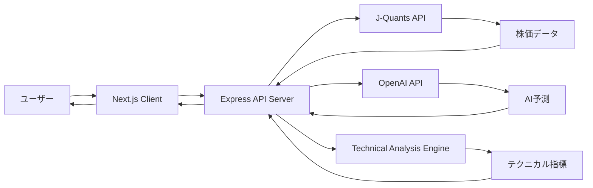

# プロジェクト構造

## ディレクトリ構成

```
trend_cast/
├── docs/                           # ドキュメント
│   ├── requirements.md            # 要件定義書
│   ├── api-specification.md       # API仕様書
│   └── project-structure.md       # プロジェクト構造（本ファイル）
│
├── src/                           # ソースコード
│   ├── client/                    # Next.jsクライアント
│   │   ├── app/                   # App Router
│   │   │   ├── layout.tsx         # ルートレイアウト
│   │   │   ├── page.tsx           # トップページ
│   │   │   ├── login/
│   │   │   │   └── page.tsx       # ログインページ
│   │   │   └── stocks/
│   │   │       ├── page.tsx       # 銘柄検索ページ
│   │   │       └── [code]/
│   │   │           └── page.tsx   # 銘柄詳細・分析ページ
│   │   │
│   │   ├── components/            # Reactコンポーネント
│   │   │   ├── common/
│   │   │   │   ├── Header.tsx     # ヘッダー
│   │   │   │   └── Loading.tsx    # ローディング表示
│   │   │   ├── auth/
│   │   │   │   └── LoginForm.tsx  # ログインフォーム
│   │   │   ├── stocks/
│   │   │   │   ├── SearchForm.tsx # 銘柄検索フォーム
│   │   │   │   └── StockList.tsx  # 銘柄リスト
│   │   │   └── charts/
│   │   │       ├── PriceChart.tsx # 株価チャート
│   │   │       ├── TechnicalChart.tsx # テクニカル指標チャート
│   │   │       └── PredictionChart.tsx # 予測チャート
│   │   │
│   │   ├── lib/                   # ユーティリティ
│   │   │   ├── api.ts            # APIクライアント
│   │   │   ├── auth.ts           # 認証関連
│   │   │   └── chart-config.ts   # Plotly.js設定
│   │   │
│   │   ├── types/                # TypeScript型定義
│   │   │   ├── stock.ts          # 株価関連の型
│   │   │   ├── technical.ts      # テクニカル分析の型
│   │   │   └── prediction.ts     # 予測関連の型
│   │   │
│   │   ├── styles/               # スタイルシート
│   │   │   └── globals.css       # グローバルスタイル
│   │   │
│   │   ├── package.json
│   │   ├── tsconfig.json
│   │   ├── next.config.js
│   │   └── .env.local            # 環境変数（クライアント用）
│   │
│   ├── server/                    # Express.jsサーバー
│   │   ├── index.ts              # エントリーポイント
│   │   ├── app.ts                # Expressアプリケーション設定
│   │   │
│   │   ├── config/               # 設定
│   │   │   ├── index.ts          # 設定ローダー
│   │   │   └── constants.ts      # 定数定義
│   │   │
│   │   ├── middleware/           # ミドルウェア
│   │   │   ├── auth.ts           # Basic認証
│   │   │   ├── error-handler.ts  # エラーハンドリング
│   │   │   └── rate-limiter.ts   # レート制限
│   │   │
│   │   ├── routes/               # ルーティング
│   │   │   ├── index.ts          # ルート集約
│   │   │   ├── auth.routes.ts    # 認証エンドポイント
│   │   │   ├── stocks.routes.ts  # 株価エンドポイント
│   │   │   └── predict.routes.ts # 予測エンドポイント
│   │   │
│   │   ├── controllers/          # コントローラー
│   │   │   ├── auth.controller.ts
│   │   │   ├── stocks.controller.ts
│   │   │   └── predict.controller.ts
│   │   │
│   │   ├── services/             # ビジネスロジック
│   │   │   ├── jquants.service.ts # J-Quants API連携
│   │   │   ├── technical.service.ts # テクニカル分析
│   │   │   ├── openai.service.ts # OpenAI API連携
│   │   │   └── cache.service.ts  # キャッシュ管理
│   │   │
│   │   ├── utils/                # ユーティリティ
│   │   │   ├── logger.ts         # ロガー
│   │   │   ├── validators.ts     # バリデーション
│   │   │   └── rate-limit.ts     # レート制限ヘルパー
│   │   │
│   │   ├── types/                # TypeScript型定義
│   │   │   ├── api.ts            # API関連の型
│   │   │   ├── jquants.ts        # J-Quants API型
│   │   │   └── openai.ts         # OpenAI関連の型
│   │   │
│   │   ├── package.json
│   │   ├── tsconfig.json
│   │   └── .env                  # 環境変数（サーバー用）
│   │
│   └── shared/                    # 共有コード
│       └── types/                # 共通型定義
│           ├── stock.ts
│           ├── technical.ts
│           └── prediction.ts
│
│
├── public/                        # 静的ファイル（Next.js用）
│   └── favicon.ico
│
├── scripts/                       # 開発用スクリプト
│   ├── dev.sh                    # 開発サーバー起動
│   ├── build.sh                  # ビルドスクリプト
│   └── test-api.sh               # API動作確認
│
├── .gitignore
├── .env.example                  # 環境変数のテンプレート
├── package.json                  # ルートパッケージ（monorepo）
└── README.md                     # プロジェクト説明

```

## 主要ファイルの説明

### クライアント側

#### `/src/client/app/stocks/[code]/page.tsx`
メインページ。銘柄詳細、チャート表示、予測結果を統合表示

#### `/src/client/components/charts/PriceChart.tsx`
Plotly.jsを使用したインタラクティブな株価チャートコンポーネント

#### `/src/client/lib/api.ts`
サーバーAPIとの通信を管理するクライアント

### サーバー側

#### `/src/server/services/jquants.service.ts`
J-Quants APIとの連携を管理。認証、データ取得、レート制限対応

#### `/src/server/services/technical.service.ts`
テクニカル指標の計算ロジック（SMA、EMA、MACD、RSI、ボリンジャーバンド）

#### `/src/server/services/openai.service.ts`
OpenAI APIとの連携、プロンプト生成、予測結果の解析

#### `/src/server/middleware/auth.ts`
Basic認証の実装。環境変数から複数ユーザーの認証情報を管理

## 環境変数

### サーバー側 (src/server/.env)
```env
# Server
PORT=3001
NODE_ENV=development

# Authentication
AUTH_USERS=user1:password1,user2:password2,user3:password3

# J-Quants API
JQUANTS_API_MAIL=your-email@example.com
JQUANTS_API_PASSWORD=your-password
JQUANTS_REFRESH_TOKEN=

# OpenAI API
OPENAI_API_KEY=sk-...
OPENAI_MODEL=gpt-4

# Rate Limiting
RATE_LIMIT_WINDOW_MS=60000
RATE_LIMIT_MAX_REQUESTS=100
```

### クライアント側 (src/client/.env.local)
```env
NEXT_PUBLIC_API_URL=http://localhost:3001/api
```

## 開発フロー

### 1. 初期セットアップ
```bash
# リポジトリクローン
git clone <repository>
cd trend_cast

# 依存関係インストール
npm install
cd src/client && npm install
cd ../server && npm install
cd ../..

# 環境変数設定
cp .env.example src/server/.env
cp .env.example src/client/.env.local
# 各.envファイルを編集

# J-Quants APIの認証トークン取得
npm run jquants:auth
```

### 2. 開発サーバー起動
```bash
# 両サーバーを同時起動
npm run dev

# または個別起動
npm run dev:server  # Express (port 3001)
npm run dev:client  # Next.js (port 3000)
```

### 3. ビルド
```bash
# プロダクションビルド
npm run build

# 本番環境起動
npm run start
```

## データフロー



## 技術的な考慮事項

### セキュリティ
- Basic認証による簡易的なアクセス制御
- 環境変数によるAPIキー管理
- CORS設定による不正アクセス防止

### パフォーマンス
- 必要最小限のキャッシュ実装
- レート制限への対応
- 非同期処理による効率化

### エラーハンドリング
- 外部API障害時のフォールバック
- ユーザーフレンドリーなエラーメッセージ
- ログによる問題追跡

### 拡張性
- モジュール化された構造
- 型安全性の確保（TypeScript）
- 設定の外部化